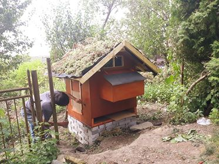

# :chicken: :rooster: :baby_chick: :hatched_chick: Chickenhouse.io

Hobby project aiming to create an opensource self-sovereign chickenhouse that can provide 
both happy lives for chicken and possibly generate some revenue for people using it.

## Philosophy

:family: Keeping chicken in these concentration camps is just terrible. I don't like it.

:construction_worker: Yeah. Me neither. 

:family: We should ban it! It should be illegal.

:construction_worker: Noo! Banning does not change anything and is [not ethical at all.](https://en.wikipedia.org/wiki/Anarcho-capitalism)

:construction_worker: Ok, so what?

:family: Let's not purchase from those who treat chicken bad. It's that easy.

:family: Hmm. But we like eggs! 

:construction_worker: Yes, purchase them from those who is nice to their chicken. Or get your own chicken. 

## Architecture 

### Chicken house

Approx 1 square meter wooden box. Seems like if decent range is provided for chicken to spend their free time there may be
5 chicks sharing this one comfortably. Estimated upper limit would be 8 chicken I guess. 

### Chicken house controller

Raspberry PI with following peripherals: 
  - camera
  - door module
  - led light module

Controller is connected to home WIFI. SSH access to the coop achieved with http://www.remote.it/

TODOs:
 - add startup script (wifi, clone repo, build, run...)
### Server

Google cloud. Not my option of choice, it's google right.. but it is easy to use..
Currently chickenhouse needs:
  - firestore for realtime database with bidirectional communication 
  - cloud functions for integration with btc pay server (accepting webhooks)
  - hosting for web
### Web 

Simple web interface to control chicken house remotely. https://probable-bebop-176607.firebaseapp.com/

### BtcPay server [wip]

Idea is to add possibility to pay for eggs with lightning network. Currently in progress.

Btc pay server hosted here https://btcpay883288.lndyn.com/
